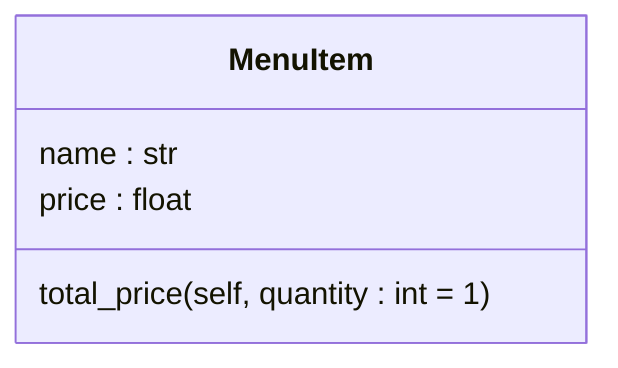
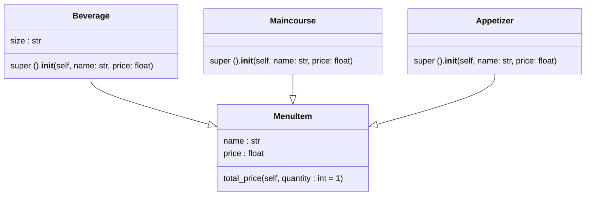
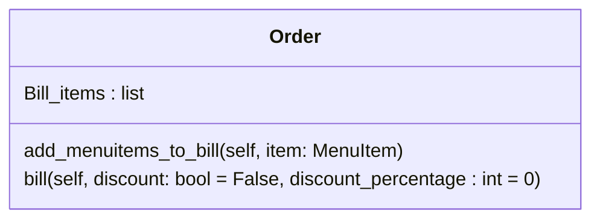

# Reto 3 Eli-Caro - Caso del restaurante
Durante la sesión número 8 de programación orientada a objetos se trato el tema de composición y se comparo con la herencia de clases, este reto propusó el modulado una situación de restaurante, haciendo uso de herencia y composición de clase, este repositorio tiene la finalidad de organizar mi código utilizando digramas UML.

# Creacion de la clase MenuItem

# Relación de herenncia entre MenuItem - Beverage, Maincourse y Appetizer

# Creación de la clase order

