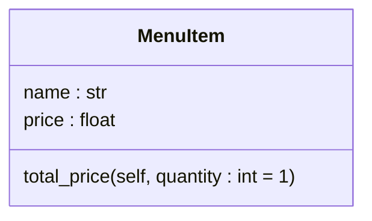
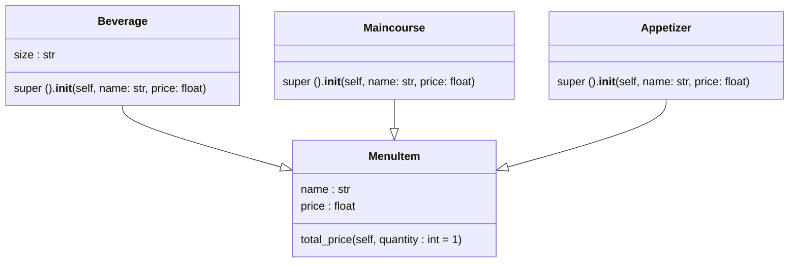
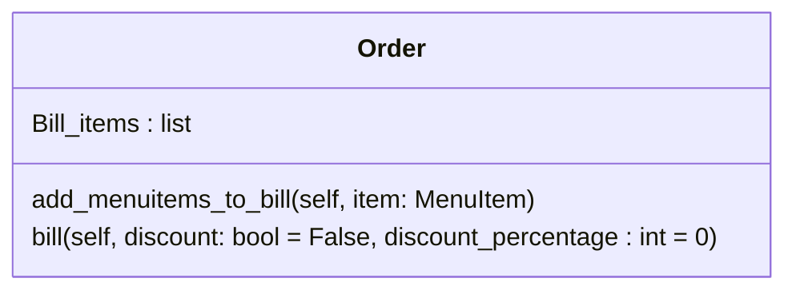

# Reto 3 Eli-Caro - Caso del restaurante
Durante la sesión número 8 de programación orientada a objetos se trato el tema de composición y se comparó con la herencia de clases, este reto propusó el modulado una situación de restaurante, haciendo uso de herencia y composición de clase, este repositorio tiene la finalidad de organizar mi código utilizando digramas UML.

## Creacion de la clase MenuItem
La clase `MenuItem` permite crear instancias que representan un elemento cualquiera de un menú de restaurante, cuenta con los atributos `name` y `price` y un método llamado `total_price` que permite calcular el precio de dicho elemento basado en su cantidad, que por defecto es uno (1).

Dentro del ejercicio la clase `MenuItem` se utiliza como clase base para crear clases más especializadas.

```python
class MenuItem:
    def __init__(self, name = str, price = float):
        self.name = name
        self.price = price
    
    def total_price (self, quantity: int = 1):
        """Calculus based on the quantity of the item."""
        return self.price * quantity
```


## Relación de herencia entre MenuItem - Beverage, Maincourse y Appetizer
Siguiendo el orden de resulución del ejercicio se crean las clases `Beverage` (bebidas), `Maincourse` (platos principales) y `Appetizer` (aperitivos) que heredan atributos y métodos de la clase `MenuItem`, la clase `Appetizer` agrega un atributo más al inicializador de la clase base llamado `size`.

Esta parte del ejercicio pone en practica el uso de la herencia para producir clases más especializadas que heredan atributos y métodos de una clase base.

```python
# Classes that inherit the class MenuItem  
class Beverage (MenuItem):
    def __init__(self, name: str, price: float, size: str):
        super().__init__(name, price)
        self.size = size

class Maincourse (MenuItem):
    def __init__(self, name: str, price: float):
        super().__init__(name, price)

class Appetizer (MenuItem):
    def __init__(self, name: str, price: float):
        super().__init__(name, price)
```



## Creación de la clase order
Para calcular el costo de los elementos del menú se creo la clase `Order` que posee como atributo una lista vacío una lista llamada `Bill_items`, un método llamado `add_menuitems_to_bill` que permite añadir instancias de la clase `MenuItem` a la lista vacía y un método llamado `bill`, utilizado para calcular el precio total de los elementos de la cuenta y aplicar descuentos al valor final. 

Dentro del contexto del ejercicio la clase `Order` es un ejemplo de la aplicación de composición, ya que esta clase utiliza funcionalidades de las otras clases sin heredar de ellas directamente, en este caso `MenuItem` y las emplea como parte de sus propiedades, viendose esto reflejado en el uso del método `total_price` para calcular el precio de la cuenta.

```python
# Definition of Order class
class Order:
    def __init__(self):
        self.Bill_items = []
        
    def add_menuitems_to_bill (self, item: "MenuItem"):
        self.Bill_items.append (item)
    
    def bill (self, discount: bool = False, discount_percentage : int = 0):
        
        self.Bill = float (0)
        
        for item in self.Bill_items:
            self.Bill += item.total_price ()
        
        if discount == False:
            return self.Bill
        else:
            return self.Bill - (self.Bill * (discount_percentage / 100))
```



## Totalidad del código más un ejemplo de uso
```python
class MenuItem:
    def __init__(self, name = str, price = float):
        self.name = name
        self.price = price
    
    def total_price (self, quantity: int = 1):
        """Calculus based on the quantity of the item."""
        return self.price * quantity

# Classes that inherit the class MenuItem  
class Beverage (MenuItem):
    def __init__(self, name: str, price: float, size: str):
        super().__init__(name, price)
        self.size = size

class Maincourse (MenuItem):
    def __init__(self, name: str, price: float):
        super().__init__(name, price)

class Appetizer (MenuItem):
    def __init__(self, name: str, price: float):
        super().__init__(name, price)

# Definition of Order class
class Order:
    def __init__(self):
        self.Bill_items = []
        
    def add_menuitems_to_bill (self, item: "MenuItem"):
        self.Bill_items.append (item)
    
    def bill (self, discount: bool = False, discount_percentage : int = 0):
        
        self.Bill = float (0)
        
        for item in self.Bill_items:
            self.Bill += item.total_price ()
        
        if discount == False:
            return self.Bill
        else:
            return self.Bill - (self.Bill * (discount_percentage / 100))

# Usage examples
Client_order = Order ()

# Items
Client_order.add_menuitems_to_bill (Beverage ("Coke", 2.5, "Large"))
Client_order.add_menuitems_to_bill (Appetizer ("Spring Rolls", 5.0))
Client_order.add_menuitems_to_bill (Maincourse ("Spaghetti", 12.0))

Client_order.add_menuitems_to_bill (Beverage ("Fanta", 2.5, "small"))
Client_order.add_menuitems_to_bill (Appetizer ("Sushi", 4.0))
Client_order.add_menuitems_to_bill (Maincourse ("Fried mojara", 15.00))

Client_order.add_menuitems_to_bill (Beverage ("Coke", 2.5, "Large"))
Client_order.add_menuitems_to_bill (Appetizer ("French fries", 3.5))
Client_order.add_menuitems_to_bill (Appetizer ("Fried yucca", 4.0))
Client_order.add_menuitems_to_bill (Maincourse ("Lasagna", 20.0))

# Client_order without apliying discount
print(f"Total before discount: ${Client_order.bill ()}")

# Client_order without apliying a 10% discount
print(f"Total after 10% discount: ${Client_order.bill (True, 10)}")
```
