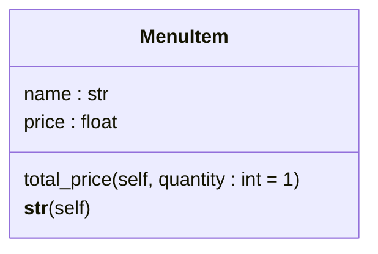
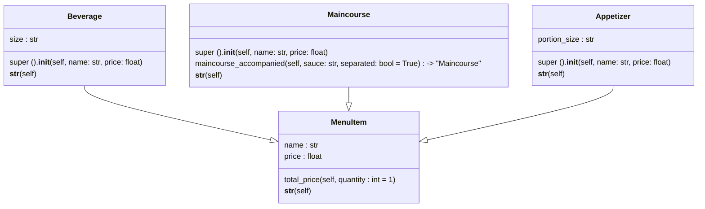
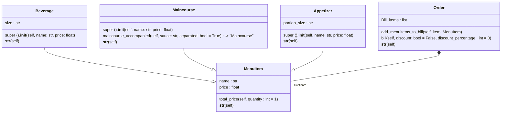

# Reto 3 Eli-Caro - Caso del restaurante
Durante la sesión número 8 de programación orientada a objetos se trato el tema de composición y se comparó con la herencia de clases, este reto propusó el modulado una situación de restaurante, haciendo uso de herencia y composición de clase, este repositorio tiene la finalidad de organizar mi código utilizando digramas UML. Adiciionalmente cada clase cuenta con el dunder method `__str__` que entrega una representación en cadena de caracteres de las instancias de cada clase.

## Creacion de la clase MenuItem
La clase `MenuItem` permite crear instancias que representan un elemento cualquiera de un menú de restaurante, cuenta con los atributos `name` y `price` y un método llamado `total_price` que permite calcular el precio de dicho elemento basado en su cantidad, que por defecto es uno (1).

Dentro del ejercicio la clase `MenuItem` se utiliza como clase base para crear clases más especializadas.

```python
class MenuItem:
    """MenuItem class used to create restaurant dishes."""
    
    def __init__(self, name: str, price: float):
        """Initialize a MenuItem object with name and price parameters.

        - param name: Name of the MenuItem object.
        - param price: Price of the MenuItem object.
        """
        self.name = name
        self.price = price
   
    def total_price(self, quantity: int = 1) -> float:
        """Return a float data type of the MenuItem price.

        Calculus based on the quantity of the MenuItem, 1 by defalut.
        """
        return self.price * quantity
    
    def __str__(self):
        """Return a string representation of the MenuItem object."""
        return self.name
```


## Relación de herencia entre MenuItem - Beverage, Maincourse y Appetizer
Siguiendo el orden de resulución del ejercicio se crean las clases `Beverage` (bebidas), `Maincourse` (platos principales) y `Appetizer` (aperitivos) que heredan atributos y métodos de la clase `MenuItem`, cada una de estas clases tiene atributos o métodos únicos por ejemplo:

1. La clase `Beverage` agrega un atributo más al inicializador de la clase base llamado `size`.
2. La clase `Maincourse` agrega un método llamado `maincourse_accompanied` que modifica el nombre de la instancia y devuelve la instancia con su atributo `name` modificado con una salsa, indicando si esta servida por separado o no.
3. La clase `Appetizer` agrega un atributo más al inicializador de la clase base llamado `portion_size`.

Esta parte del ejercicio pone en practica el uso de la herencia para producir clases más especializadas que heredan atributos y métodos de una clase base.

```python
# Classes that inherit the class MenuItem 
class Beverage(MenuItem):
    """Beverage class inherit methods and attributes from MenuItem class."""
    
    def __init__(self, name: str, price: float, size: str):
        """Initialize a Beverage object with name, price and size parameters.

        - param name: Name of the Beverage object.
        - param price: Price of the Beverage object.
        - param size: Size of the Beverage object (small, medium, large).
        """

        super().__init__(name, price)
        self.size = size

    def __str__(self):
        """Return a string representation of the Beverage object."""
        return f"{self.name} ({self.size})"


class Maincourse(MenuItem):
    """Maincourse class inherit methods and attributes from MenuItem class."""
    
    def __init__(self, name: str, price: float):
        """Initialize a Maincourse object with name and price parameters.

        - param name: Name of the Maincourse object.
        - param price: Price of the Maincourse object.
        """

        super().__init__(name, price)
    
    def maincourse_accompanied(self, sauce: str, separated: bool = True) -> "Maincourse":
        """Returns a modified Maincourse instance with the sauce added to it.

        - param sauce: Indicates the sauce of the Maincourse object.
        - param separated: Specify if the sauce is served separetly of the Maincourse
        object, True, by default.
        """
        if sauce != None and separated == True:
            self.name = f"{self.name} with {sauce} separately"
            return self
        elif sauce != None and separated == False:
            self.name = f"{self.name} with {sauce} on the plate"
            return self
        else:
            raise ValueError ("You must specify the sauce to add it.")
    
    def __str__(self):
        """Return a string representation of the Maincourse object."""
        return self.name


class Appetizer(MenuItem):
    """Appetizer class inherit methods and attributes from MenuItem class."""
    
    def __init__(self, name: str, price: float, portion_size: str):
        """Initialize a Appetizer object with name, price and portion_size parameters.

        - param name: Name of the Appetizer object.
        - param price: Price of the Appetizer object.
        - param portion_size: Portion size of the Appetizer object
        (small, medium, large).
        """

        super().__init__(name, price)
        self.portion_size = portion_size

    def __str__(self):
        """Return a string representation of the Appetizer object."""
        return f"{self.name} ({self.portion_size})"
```



## Creación de la clase order
Para calcular el costo de los elementos del menú se creo la clase `Order` que posee como atributo una lista vacío una lista llamada `Bill_items`, un método llamado `add_menuitems_to_bill` que permite añadir instancias de la clase `MenuItem` a la lista vacía y un método llamado `bill`, utilizado para calcular el precio total de los elementos de la cuenta y aplicar descuentos al valor final. 

Dentro del contexto del ejercicio la clase `Order` es un ejemplo de la aplicación de composición, ya que esta clase utiliza funcionalidades de las otras clases sin heredar de ellas directamente, en este caso `MenuItem` y las emplea como parte de sus propiedades, viendose esto reflejado en el uso del método `total_price` para calcular el precio de la cuenta.

```python
# Definition of Order class
class Order:
    """Order class is used to create and calculate the bill."""
    def __init__(self):
        """Initialize an Order with an empty list of items."""
        self.bill_items = []
          
    def add_menuitems_to_bill(self, item: "MenuItem"):
        """Adds a MenuItem object to the order.

        - param item: A MenuItem instance to be added.
        """
        self.bill_items.append(item)
    
    def bill(self, discount: bool = False, discount_percentage: int = 0):
        """Returns the total bill with an optional discount (if any).

        - param discount: Whether to apply a discount.
        - param discount_percentage: Percentage of the discount.
        """
        self.total = float(0)
        
        for item in self.bill_items:
            self.total += item.total_price()
        
        if discount == False:
            return self.total
        else:
            return self.total - (self.total * (discount_percentage / 100))

    def __str__(self):
        """Return a string representation of the Order object."""
        return ", ".join(str(item) for item in self.bill_items)
```



## Totalidad del código más un ejemplo de uso
```python
# Restaurant case
class MenuItem:
    """MenuItem class used to create restaurant dishes."""
    
    def __init__(self, name: str, price: float):
        """Initialize a MenuItem object with name and price parameters.

        - param name: Name of the MenuItem object.
        - param price: Price of the MenuItem object.
        """
        self.name = name
        self.price = price
   
    def total_price(self, quantity: int = 1) -> float:
        """Return a float data type of the MenuItem price.

        Calculus based on the quantity of the MenuItem, 1 by defalut.
        """
        return self.price * quantity
    
    def __str__(self):
        """Return a string representation of the MenuItem object."""
        return self.name


# Classes that inherit the class MenuItem  
class Beverage(MenuItem):
    """Beverage class inherit methods and attributes from MenuItem class."""
    
    def __init__(self, name: str, price: float, size: str):
        """Initialize a Beverage object with name, price and size parameters.

        - param name: Name of the Beverage object.
        - param price: Price of the Beverage object.
        - param size: Size of the Beverage object (small, medium, large).
        """

        super().__init__(name, price)
        self.size = size

    def __str__(self):
        """Return a string representation of the Beverage object."""
        return f"{self.name} ({self.size})"


class Maincourse(MenuItem):
    """Maincourse class inherit methods and attributes from MenuItem class."""
    
    def __init__(self, name: str, price: float):
        """Initialize a Maincourse object with name and price parameters.

        - param name: Name of the Maincourse object.
        - param price: Price of the Maincourse object.
        """

        super().__init__(name, price)
    
    def maincourse_accompanied(self, sauce: str, separated: bool = True) -> "Maincourse":
        """Returns a modified Maincourse instance with the sauce added to it.

        - param sauce: Indicates the sauce of the Maincourse object.
        - param separated: Specify if the sauce is served separetly of the Maincourse
        object, True, by default.
        """
        if sauce != None and separated == True:
            self.name = f"{self.name} with {sauce} separately"
            return self
        elif sauce != None and separated == False:
            self.name = f"{self.name} with {sauce} on the plate"
            return self
        else:
            raise ValueError ("You must specify the sauce to add it.")
    
    def __str__(self):
        """Return a string representation of the Maincourse object."""
        return self.name


class Appetizer(MenuItem):
    """Appetizer class inherit methods and attributes from MenuItem class."""
    
    def __init__(self, name: str, price: float, portion_size: str):
        """Initialize a Appetizer object with name, price and portion_size parameters.

        - param name: Name of the Appetizer object.
        - param price: Price of the Appetizer object.
        - param portion_size: Portion size of the Appetizer object
        (small, medium, large).
        """

        super().__init__(name, price)
        self.portion_size = portion_size

    def __str__(self):
        """Return a string representation of the Appetizer object."""
        return f"{self.name} ({self.portion_size})"


# Definition of Order class
class Order:
    """Order class is used to create and calculate the bill."""
    def __init__(self):
        """Initialize an Order with an empty list of items."""
        self.bill_items = []
          
    def add_menuitems_to_bill(self, item: "MenuItem"):
        """Adds a MenuItem object to the order.

        - param item: A MenuItem instance to be added.
        """
        self.bill_items.append(item)
    
    def bill(self, discount: bool = False, discount_percentage: int = 0):
        """Returns the total bill with an optional discount (if any).

        - param discount: Whether to apply a discount.
        - param discount_percentage: Percentage of the discount.
        """
        self.total = float(0)
        
        for item in self.bill_items:
            self.total += item.total_price()
        
        if discount == False:
            return self.total
        else:
            return self.total - (self.total * (discount_percentage / 100))

    def __str__(self):
        """Return a string representation of the Order object."""
        return ", ".join(str(item) for item in self.bill_items)
    

# Usage example
client_order = Order()

# Items
client_order.add_menuitems_to_bill(Beverage("Coke", 2.5, "Large"))
client_order.add_menuitems_to_bill(Appetizer("Spring Rolls", 5.0, "medium"))
client_order.add_menuitems_to_bill(
    Maincourse("Spaghetti", 12.0).maincourse_accompanied(
        sauce="Bolognesa sauce", separated=False
    )
)

client_order.add_menuitems_to_bill(Beverage("Fanta", 2.5, "small"))
client_order.add_menuitems_to_bill(Appetizer("Sushi", 4.0, "small"))
client_order.add_menuitems_to_bill(Maincourse("Fried mojara", 15.00))

client_order.add_menuitems_to_bill(Beverage("Coke", 2.5, "Large"))
client_order.add_menuitems_to_bill(Appetizer("French fries", 3.5, "medium"))
client_order.add_menuitems_to_bill(Appetizer("Fried yucca", 4.0, "small"))
client_order.add_menuitems_to_bill(Maincourse("Lasagna", 20.0))

# client_order without apliying discount
print(f"Total before discount: ${client_order.bill():.2f}")

# client_order without apliying a 10% discount
print(f"Total after 10% discount: ${client_order.bill(True, 10):.2f}")
```
